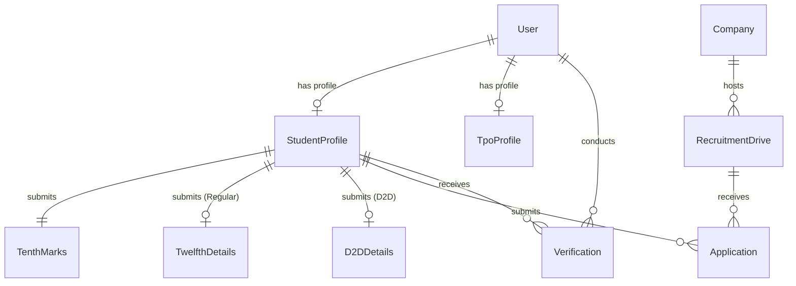

# Data Model Specification: Mini Placement Portal

## 1. Domain Entities & Relationships

---

## 2. Enums

### `Role`
* `STUDENT`: Candidate student.
* `TPO`: Central Training & Placement Officer.

### `StudentType`
* `REGULAR`: Entered through standard 10th + 12th path. Requires `TwelfthDetails`.
* `D2D`: Diploma to Degree lateral entry. Requires `D2DDetails`.

### `ProfileStatus`
* `DRAFT`: Initial editable state. Student can update personal and marks data.
* `LOCKED`: Immutable to the student once submitted. Only TPO can modify.

### `VerificationStatus`
* `PENDING`: Awaiting TPO review.
* `VERIFIED`: Approved by TPO.
* `REJECTED`: Rejected by TPO with audit remarks.

### `ApplicationStatus`
* `APPLIED`: Application submitted.
* `UNDER_REVIEW`: TPO or company reviewing application.
* `SHORTLISTED`: Shortlisted for interview rounds.
* `REJECTED`: Rejected.
* `SELECTED`: Offer extended / accepted.

### `DriveType`
* `FULL_TIME`
* `INTERNSHIP`
* `INTERN_PLUS_FTE`

### `DriveStatus`
* `UPCOMING`
* `ACTIVE`
* `COMPLETED`
* `CANCELLED`

---

## 3. Academic Marks Formula & Rules

1. **10th Standard Marks**:
   * Total marks obtained $\div$ Maximum marks $\times 100 =$ `percentage` (calculated with 2 decimal precision).
   * Stored in `TenthMarks` alongside subject-wise breakdown in JSON.

2. **12th Standard Marks (Regular Students)**:
   * Mandatory for `StudentType.REGULAR`.
   * Recorded in `TwelfthDetails`.

3. **Diploma Details (D2D Students)**:
   * Mandatory for `StudentType.D2D`.
   * Recorded in `D2DDetails` with `diplomaCgpa` and `diplomaPercentage`.
